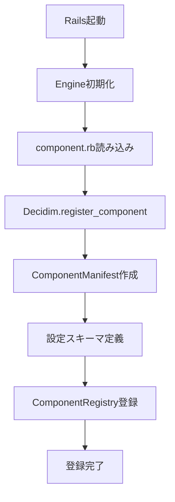
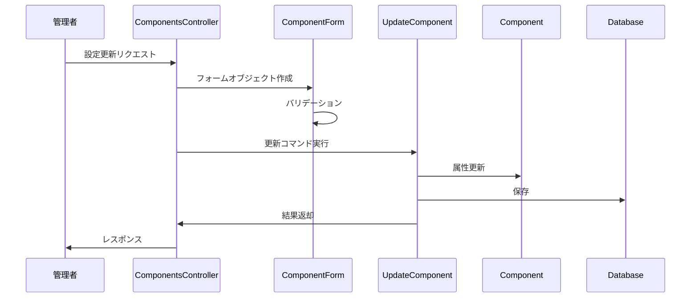
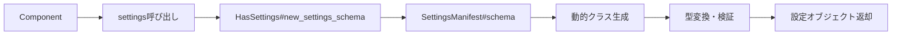

# Decidim コンポーネントアーキテクチャガイド

## 目次

1. [概要](#概要)
2. [コンポーネントの基本構造](#コンポーネントの基本構造)
3. [コンポーネントマニフェスト](#コンポーネントマニフェスト)
4. [設定システム](#設定システム)
5. [データフローと処理シーケンス](#データフローと処理シーケンス)
6. [コンポーネントのライフサイクル](#コンポーネントのライフサイクル)

## 概要

Decidimのコンポーネントは、参加型民主主義プラットフォームに機能を追加するための自己完結型モジュールです。各コンポーネントは独立したRailsエンジンとして実装され、提案、会議、投票などの特定の機能を提供します。

### 主要な特徴

- **モジュラー設計**: 各コンポーネントは独立して開発・保守可能
- **設定可能**: 管理者が各コンポーネントの動作を細かく制御可能
- **拡張可能**: 新しいコンポーネントの追加や既存コンポーネントのカスタマイズが容易
- **多言語対応**: 設定項目やコンテンツの多言語化を標準サポート

## コンポーネントの基本構造

### ファイル構成

```
decidim-[component_name]/
├── app/
│   ├── controllers/
│   ├── models/
│   ├── views/
│   └── ...
├── config/
│   ├── locales/
│   └── routes.rb
├── db/
│   └── migrate/
├── lib/
│   ├── decidim/
│   │   ├── [component_name]/
│   │   │   ├── admin/
│   │   │   ├── api/
│   │   │   ├── component.rb    # コンポーネント定義
│   │   │   ├── engine.rb       # Railsエンジン
│   │   │   └── admin_engine.rb # 管理画面エンジン
│   │   └── [component_name].rb
│   └── tasks/
└── decidim-[component_name].gemspec
```

### 必須要素

1. **コンポーネント定義** (`component.rb`)
2. **エンジン定義** (`engine.rb`, `admin_engine.rb`)
3. **ルーティング** (`config/routes.rb`)
4. **翻訳ファイル** (`config/locales/`)

## コンポーネントマニフェスト

コンポーネントマニフェストは、コンポーネントの設定と動作を定義する中心的な要素です。

### 基本的な定義

```ruby
# lib/decidim/[component_name]/component.rb
Decidim.register_component(:component_name) do |component|
  component.engine = Decidim::ComponentName::Engine
  component.admin_engine = Decidim::ComponentName::AdminEngine
  component.icon = "media/images/icon.svg"
  component.icon_key = "component-name"
  
  # 権限管理
  component.permissions_class_name = "Decidim::ComponentName::Permissions"
  
  # アクション定義
  component.actions = %w(create update delete vote)
  
  # データエクスポート
  component.data_portable_entities = ["Decidim::ComponentName::Model"]
  
  # 設定定義
  component.settings(:global) do |settings|
    # グローバル設定
  end
  
  component.settings(:step) do |settings|
    # ステップ設定
  end
end
```

### 主要な属性

| 属性 | 説明 | 必須 |
|-----|------|------|
| `name` | コンポーネント識別子 | ✓ |
| `engine` | メインエンジンクラス | ✓ |
| `admin_engine` | 管理画面エンジンクラス | ✓ |
| `icon` | アイコンファイルパス | |
| `permissions_class_name` | 権限管理クラス名 | |
| `actions` | 権限チェック可能なアクション | |
| `data_portable_entities` | エクスポート対象エンティティ | |

## 設定システム

### 設定の種類

1. **グローバル設定**: コンポーネント全体に適用される設定
2. **ステップ設定**: 参加プロセスの各段階で変更可能な設定
3. **デフォルトステップ設定**: ステップが定義されていない場合の設定

### 設定の定義

```ruby
component.settings(:global) do |settings|
  # 基本的な設定
  settings.attribute :enabled, type: :boolean, default: true
  
  # 多言語対応設定
  settings.attribute :announcement, type: :text, translated: true, editor: true
  
  # 必須設定
  settings.attribute :max_length, type: :integer, required: true
  
  # 条件付き読み取り専用
  settings.attribute :locked_setting,
    type: :boolean,
    readonly: ->(context) { context[:component].created_at < 1.week.ago }
  
  # 動的選択肢
  settings.attribute :workflow,
    type: :enum,
    choices: -> { WorkflowService.available_workflows }
end
```

### 利用可能な設定型

| 型 | 説明 | デフォルト値 |
|----|------|------------|
| `:boolean` | 真偽値 | `false` |
| `:integer` | 整数 | `0` |
| `:string` | 文字列 | `nil` |
| `:float` | 浮動小数点数 | `nil` |
| `:text` | 長文テキスト | `nil` |
| `:array` | 配列 | `[]` |
| `:enum` | 列挙型（ラジオボタン） | `nil` |
| `:select` | 選択型（ドロップダウン） | `nil` |
| `:scope` | スコープID | `nil` |
| `:time` | 日時 | `nil` |

### 設定へのアクセス

```ruby
# コンポーネント内で
component.settings.enabled
component.current_settings.announcement

# ビューで
current_component.settings.max_length

# 条件分岐
if current_component.settings.workflow == "simple"
  # シンプルワークフロー用の処理
end
```

## データフローと処理シーケンス

### コンポーネント登録フロー



### 設定更新フロー



### 設定利用フロー



## コンポーネントのライフサイクル

### 1. 初期化フェーズ

```ruby
# Railsアプリケーション起動時
Rails.application.initialize!
  └── Decidim::ComponentName::Engine.load
      └── initializer実行
          └── Decidim.register_component
```

### 2. インスタンス作成

```ruby
# 管理者がコンポーネントを追加
CreateComponent.call(form) do
  on(:ok) do |component|
    # コンポーネント作成成功
    # デフォルト設定の適用
    # フック実行
  end
end
```

### 3. 設定変更

```ruby
# 管理者が設定を更新
UpdateComponent.call(form, component) do
  on(:ok) do
    # 設定保存
    # イベント発行
    # キャッシュクリア
  end
end
```

### 4. 実行時

```ruby
# ユーザーがコンポーネントにアクセス
class ComponentController < ApplicationController
  def show
    # current_component.settingsで設定を利用
    # 設定に基づいた動作制御
  end
end
```

### 5. フックポイント

コンポーネントは以下のタイミングでフックを実行できます：

```ruby
component.on(:create) do |component|
  # コンポーネント作成時
end

component.on(:update) do |component|
  # コンポーネント更新時
end

component.on(:destroy) do |component|
  # コンポーネント削除時
end
```

## データベース構造

### decidim_componentsテーブル

```sql
CREATE TABLE decidim_components (
  id bigserial PRIMARY KEY,
  manifest_name character varying NOT NULL,
  name jsonb DEFAULT '{}',
  participatory_space_type character varying NOT NULL,
  participatory_space_id bigint NOT NULL,
  settings jsonb DEFAULT '{}',
  weight integer DEFAULT 0,
  permissions jsonb,
  published_at timestamp,
  created_at timestamp NOT NULL,
  updated_at timestamp NOT NULL
);
```

### settings列の構造

```json
{
  "global": {
    "enabled": true,
    "announcement": {
      "en": "Welcome",
      "ja": "ようこそ"
    },
    "max_length": 1000
  },
  "default_step": {
    "votes_enabled": true
  },
  "steps": {
    "123": {
      "votes_enabled": false,
      "creation_enabled": true
    }
  }
}
```

## セキュリティとパフォーマンス

### セキュリティ考慮事項

1. **権限チェック**: すべてのアクションで適切な権限確認
2. **入力検証**: 設定値の型チェックとサニタイズ
3. **SQLインジェクション対策**: パラメータ化クエリの使用

### パフォーマンス最適化

1. **設定のキャッシュ**: 頻繁にアクセスされる設定のメモ化
2. **遅延読み込み**: 必要時のみマニフェストを読み込み
3. **バッチ処理**: 複数コンポーネントの設定を一括取得

## まとめ

Decidimのコンポーネントアーキテクチャは、柔軟性と拡張性を重視した設計になっています。マニフェストベースの設定システムにより、新しい機能の追加や既存機能のカスタマイズが容易に行えます。このガイドで説明した概念を理解することで、効果的なコンポーネント開発が可能になります。
