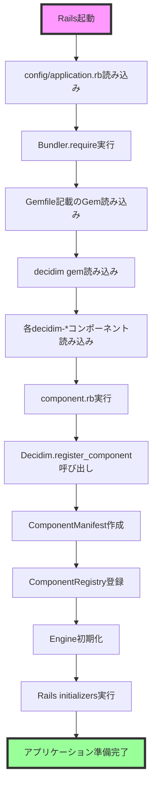
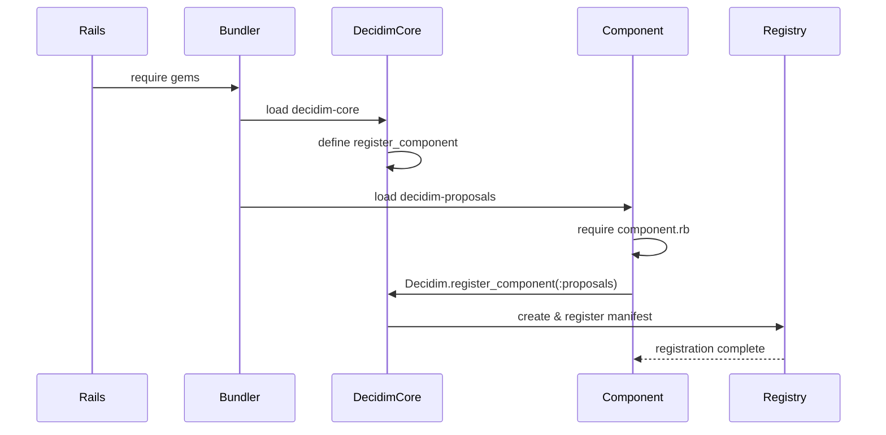

# Decidim コンポーネント初期化フロー

このドキュメントでは、Railsアプリケーション起動時にDecidimコンポーネントがどのように初期化されるかを詳細に説明します。

## 目次

1. [概要](#概要)
2. [初期化の全体像](#初期化の全体像)
3. [起動シーケンスの詳細](#起動シーケンスの詳細)
4. [コンポーネント登録メカニズム](#コンポーネント登録メカニズム)
5. [エンジンの初期化](#エンジンの初期化)
6. [初期化のタイミングと順序](#初期化のタイミングと順序)
7. [トラブルシューティング](#トラブルシューティング)

## 概要

Decidimのコンポーネントシステムは、Railsの起動プロセスと密接に統合されています。各コンポーネントは独立したRailsエンジンとして実装され、アプリケーション起動時に自動的に登録・初期化されます。

### 主要な登場人物

- **Railsアプリケーション**: 起動プロセスを管理
- **Bundler**: Gemの読み込みを管理
- **Decidimコア**: コンポーネントレジストリを提供
- **各コンポーネント**: 自身を登録し、機能を提供

## 初期化の全体像



## 起動シーケンスの詳細

### 1. Railsアプリケーションの起動

```ruby
# config/application.rb
require_relative "boot"
require "rails/all"

# Gemfileに記載されたgemを読み込む
Bundler.require(*Rails.groups)

module DecidimApp
  class Application < Rails::Application
    # アプリケーション設定
  end
end
```

### 2. Decidim本体の読み込み

```ruby
# Gemfile
gem "decidim", "~> 0.27.0"
gem "decidim-proposals", "~> 0.27.0"
gem "decidim-meetings", "~> 0.27.0"
# ... 他のコンポーネント
```

Bundler.requireにより、各gemのメインファイルが自動的に読み込まれます：

```ruby
# decidim/lib/decidim.rb
require "decidim/core"
# コアモジュールが最初に読み込まれる

# decidim-proposals/lib/decidim/proposals.rb
require "decidim/proposals/engine"
require "decidim/proposals/admin_engine"
require "decidim/proposals/component"
# 各コンポーネントのファイルが読み込まれる
```

### 3. コンポーネントの自己登録

各コンポーネントのcomponent.rbファイルが実行され、自身を登録します：

```ruby
# decidim-proposals/lib/decidim/proposals/component.rb
Decidim.register_component(:proposals) do |component|
  component.engine = Decidim::Proposals::Engine
  component.admin_engine = Decidim::Proposals::AdminEngine
  component.icon = "media/images/decidim_proposals.svg"
  component.icon_key = "chat-new-line"
  component.permissions_class_name = "Decidim::Proposals::Permissions"
  
  # コンポーネントの設定定義
  component.settings(:global) do |settings|
    settings.attribute :vote_limit, type: :integer, default: 0
    # ... その他の設定
  end
  
  # フックの定義
  component.on(:before_destroy) do |instance|
    # クリーンアップ処理
  end
  
  # リソースの登録
  component.register_resource(:proposal) do |resource|
    resource.model_class_name = "Decidim::Proposals::Proposal"
    resource.card = "decidim/proposals/proposal"
  end
  
  # 統計情報の登録
  component.register_stat :proposals_count do |components, start_at, end_at|
    Decidim::Proposals::Proposal.where(component: components).count
  end
end
```

## コンポーネント登録メカニズム

### ComponentRegistryの仕組み

```ruby
# decidim-core/lib/decidim/core.rb
module Decidim
  module Core
    # コンポーネントレジストリの定義
    def self.component_registry
      @component_registry ||= Decidim::ManifestRegistry.new(:components)
    end
    
    # register_componentメソッドの定義
    def self.register_component(name)
      manifest = Decidim::ComponentManifest.new(name: name.to_sym)
      
      yield(manifest)
      manifest.validate!
      
      component_registry.register(manifest)
    end
  end
end
```

### ManifestRegistryの実装

```ruby
# decidim-core/lib/decidim/manifest_registry.rb
module Decidim
  class ManifestRegistry
    def initialize(entity_name)
      @entity_name = entity_name
      @manifests = Set.new
    end
    
    def register(manifest)
      raise ManifestAlreadyRegistered if find(manifest.name)
      @manifests << manifest
    end
    
    def find(name)
      @manifests.find { |manifest| manifest.name.to_sym == name.to_sym }
    end
  end
end
```

## エンジンの初期化

### Engine定義の構造

```ruby
# decidim-proposals/lib/decidim/proposals/engine.rb
module Decidim
  module Proposals
    class Engine < ::Rails::Engine
      isolate_namespace Decidim::Proposals
      
      # ルーティングの定義
      routes do
        resources :proposals do
          member do
            get :compare
            get :complete
            get :preview
          end
        end
      end
      
      # 初期化処理
      initializer "decidim_proposals.icons" do
        Decidim.icons.register(name: "chat-new-line", icon: "chat-new-line", category: "system")
      end
      
      initializer "decidim_proposals.view_hooks" do
        Decidim.view_hooks.register(:participatory_space_highlighted_elements) do |view_context|
          view_context.cell("decidim/proposals/highlighted_proposals")
        end
      end
      
      initializer "decidim_proposals.gamification_badges" do
        Decidim::Gamification.register_badge(:proposals) do |badge|
          badge.levels = [1, 5, 10, 30, 60]
          badge.reset = ->(_user) { Decidim::Proposals::Proposal.where(author: _user).count }
        end
      end
      
      initializer "decidim_proposals.metrics" do
        Decidim.metrics_registry.register(:proposals) do |metric_manifest|
          metric_manifest.manager_class = "Decidim::Proposals::Metrics::ProposalsMetricManage"
        end
      end
    end
  end
end
```

### Admin Engineの初期化

```ruby
# decidim-proposals/lib/decidim/proposals/admin_engine.rb
module Decidim
  module Proposals
    class AdminEngine < ::Rails::Engine
      isolate_namespace Decidim::Proposals::Admin
      
      paths["db/migrate"] = nil
      
      routes do
        resources :proposals do
          resources :proposals_answers, only: [:edit, :update]
          resources :proposals_notes, only: [:create, :destroy]
        end
      end
      
      initializer "decidim_proposals.admin_menu" do
        Decidim.menu :admin_menu do |menu|
          menu.add_item :proposals,
                       I18n.t("menu.proposals", scope: "decidim.admin"),
                       decidim_admin_proposals.proposals_path,
                       icon_name: "chat-new-line",
                       position: 2.0,
                       active: is_active_link?(decidim_admin_proposals.proposals_path)
        end
      end
    end
  end
end
```

## 初期化のタイミングと順序

### 1. 読み込みフェーズ（同期的）



### 2. 初期化フェーズ（Rails initializers）

```ruby
# 初期化の順序制御
initializer "decidim.icons", before: :load_config_initializers do
  # アイコンの登録
end

initializer "decidim.menu", after: :load_config_initializers do
  # メニュー項目の追加
end

initializer "decidim.assets", group: :all do
  # アセットパスの設定
end
```

### 実行順序の確認方法

```bash
# Rails initializersの実行順序を確認
rails runner "Rails.application.initializers.tsort_each { |i| puts i.name }"
```

## 初期化時の重要なポイント

### 1. 遅延評価の活用

```ruby
# 良い例：必要時まで評価を遅延
component.settings(:global) do |settings|
  settings.attribute :available_methods,
    type: :array,
    default: -> { AvailableMethods.all }  # lambdaで遅延評価
end

# 悪い例：読み込み時に即座に評価
settings.attribute :available_methods,
  type: :array,
  default: AvailableMethods.all  # 初期化時にエラーの可能性
```

### 2. 依存関係の管理

```ruby
# コンポーネント間の依存を明示
initializer "decidim_proposals.dependencies", after: "decidim_comments.initialize" do
  # コメント機能に依存する初期化処理
end
```

### 3. 開発環境での再読み込み

```ruby
# config/environments/development.rb
Rails.application.configure do
  config.cache_classes = false
  config.eager_load = false
  
  # コンポーネントの再読み込みを有効化
  config.reload_plugins = true
end
```

## トラブルシューティング

### 問題1: コンポーネントが登録されない

**症状**: 管理画面でコンポーネントが表示されない

**確認方法**:
```ruby
# Rails consoleで確認
Decidim.component_manifests.map(&:name)
# => [:proposals, :meetings, :budgets, ...]  # 登録済みコンポーネント一覧
```

**解決方法**:
1. Gemfileに追加されているか確認
2. bundle installが実行されているか確認
3. component.rbファイルが正しく読み込まれているか確認

### 問題2: 初期化エラー

**症状**: 起動時にNameErrorやLoadError

**確認方法**:
```bash
# 詳細なバックトレースを表示
BACKTRACE=1 rails server
```

**解決方法**:
1. 依存関係の順序を確認
2. require文の順序を調整
3. 初期化時の即時評価を遅延評価に変更

### 問題3: 開発環境での変更が反映されない

**症状**: コードを変更してもリロードされない

**解決方法**:
```ruby
# config/environments/development.rb
Rails.application.configure do
  # コンポーネントのパスを監視対象に追加
  config.watchable_dirs["decidim-custom"] = [:rb]
end
```

### デバッグテクニック

1. **初期化の追跡**:
```ruby
# 初期化をトレース
module Decidim
  def self.register_component(name)
    Rails.logger.debug "Registering component: #{name}"
    super
  end
end
```

2. **読み込み順序の確認**:
```ruby
# $LOADED_FEATURESで読み込まれたファイルを確認
$LOADED_FEATURES.grep(/decidim/)
```

3. **初期化タイミングの測定**:
```ruby
# config/initializers/decidim_timing.rb
Rails.application.config.after_initialize do
  Rails.logger.info "All components loaded: #{Decidim.component_manifests.count}"
end
```

## まとめ

Decidimのコンポーネント初期化は、Railsの起動メカニズムを活用した洗練されたシステムです。理解すべき重要なポイント：

1. **自動登録**: component.rbファイルの読み込み時に自動的に登録
2. **遅延初期化**: 必要になるまで重い処理を遅延
3. **モジュラー設計**: 各コンポーネントが独立して初期化
4. **拡張可能**: フックとイニシャライザーで柔軟にカスタマイズ可能

この仕組みを理解することで、効率的なコンポーネント開発とトラブルシューティングが可能になります。