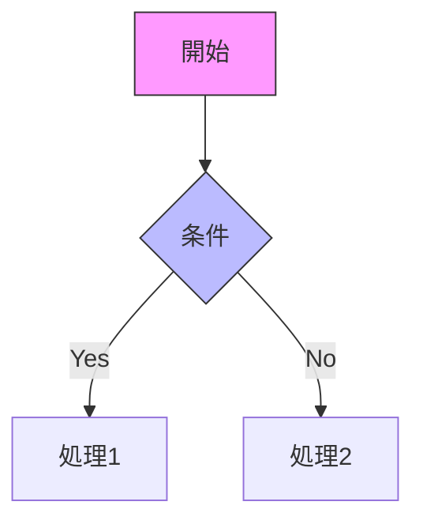

# Decidim コンポーネント図表集

このディレクトリには、Decidimコンポーネントシステムを理解するための各種図表が含まれています。
すべての図表はMermaid形式で記述されており、GitHub上で直接表示できます。

## 図表一覧

### 1. [コンポーネント登録フロー](./component-registration-flow.md)
- コンポーネント登録から利用までの全体フロー
- 設定スキーマの動的生成プロセス
- 管理画面での設定更新フロー
- 設定の型システムのクラス図

### 2. [コンポーネントライフサイクル](./component-lifecycle.md)
- コンポーネントの状態遷移図
- フックポイントとイベントシステム
- 設定の継承と優先順位
- データフローとキャッシング戦略

### 3. [設定システムアーキテクチャ](./settings-architecture.md)
- 設定システムの全体構造
- 設定型とフォームフィールドのマッピング
- 条件付き設定の評価フロー
- 多言語設定の構造
- 設定の検証パイプライン

## 図表の見方

### Mermaid図の表示方法

1. **GitHub上で表示**: 各.mdファイルをクリックすると、図表が自動的にレンダリングされます

2. **VSCodeで表示**: Mermaid拡張機能をインストールすると、エディタ内でプレビューできます

3. **その他のツール**: 
   - [Mermaid Live Editor](https://mermaid.live/)
   - [draw.io](https://app.diagrams.net/) (Mermaidインポート対応)

### 図表の種類と用途

- **フローチャート (flowchart/graph)**: プロセスの流れを表現
- **シーケンス図 (sequenceDiagram)**: 時系列での処理の流れ
- **状態図 (stateDiagram)**: コンポーネントの状態遷移
- **クラス図 (classDiagram)**: オブジェクト構造の表現

## カスタマイズ

図表をカスタマイズする場合は、以下のMermaid記法を参考にしてください：

詳細な記法については[Mermaid公式ドキュメント](https://mermaid.js.org/intro/)を参照してください。