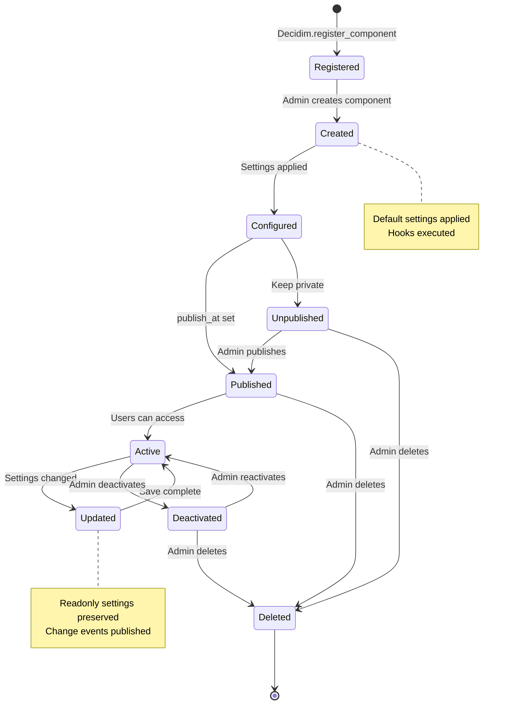
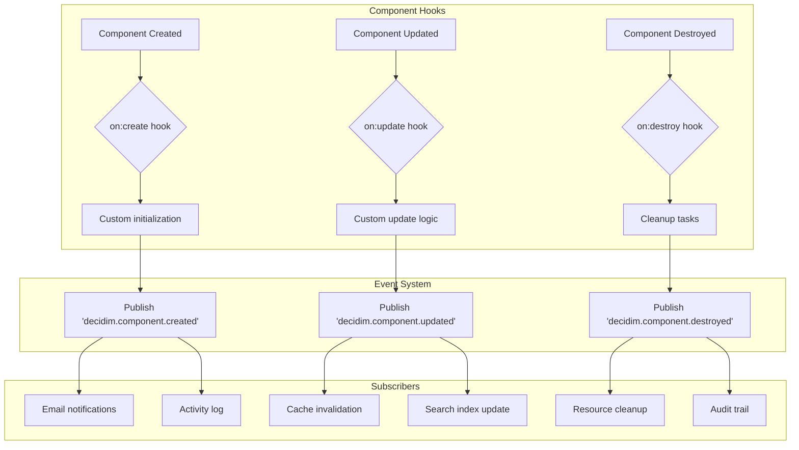
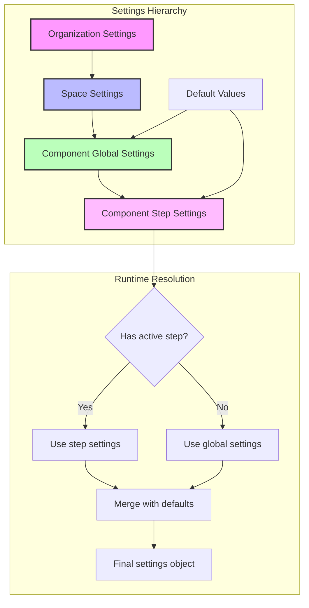
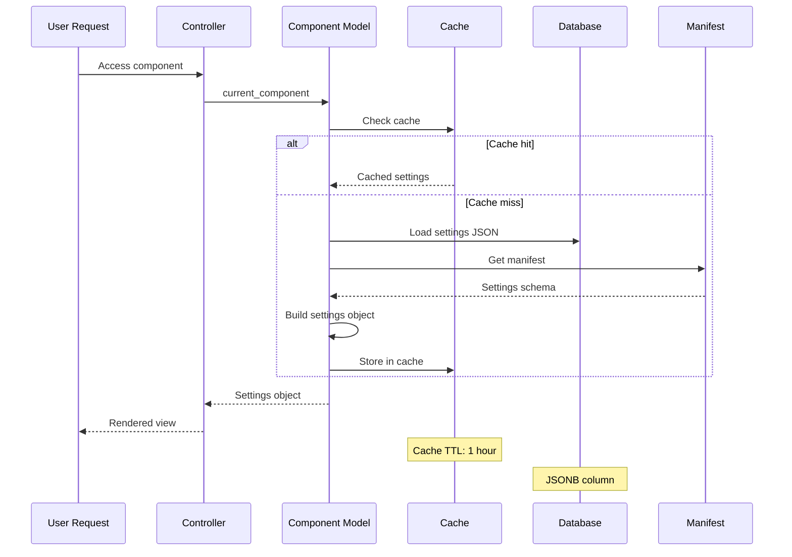

# コンポーネントライフサイクル図

## コンポーネントのライフサイクル

```mermaid
stateDiagram-v2
    [*] --> Registered: Decidim.register_component
    
    Registered --> Created: Admin creates component
    Created --> Configured: Settings applied
    
    Configured --> Published: publish_at set
    Configured --> Unpublished: Keep private
    
    Published --> Active: Users can access
    Unpublished --> Published: Admin publishes
    
    Active --> Updated: Settings changed
    Updated --> Active: Save complete
    
    Active --> Deactivated: Admin deactivates
    Deactivated --> Active: Admin reactivates
    
    Published --> Deleted: Admin deletes
    Unpublished --> Deleted: Admin deletes
    Deactivated --> Deleted: Admin deletes
    
    Deleted --> [*]
    
    note right of Created
        Default settings applied
        Hooks executed
    end note
    
    note right of Updated
        Readonly settings preserved
        Change events published
    end note
```

## フックポイントとイベント

```mermaid
flowchart TD
    subgraph "Component Hooks"
        A[Component Created] --> B{on:create hook}
        B --> C[Custom initialization]
        
        D[Component Updated] --> E{on:update hook}
        E --> F[Custom update logic]
        
        G[Component Destroyed] --> H{on:destroy hook}
        H --> I[Cleanup tasks]
    end
    
    subgraph "Event System"
        C --> J[Publish 'decidim.component.created']
        F --> K[Publish 'decidim.component.updated']
        I --> L[Publish 'decidim.component.destroyed']
    end
    
    subgraph "Subscribers"
        J --> M[Email notifications]
        J --> N[Activity log]
        K --> O[Cache invalidation]
        K --> P[Search index update]
        L --> Q[Resource cleanup]
        L --> R[Audit trail]
    end
```

## 設定の継承と優先順位

```mermaid
graph TD
    subgraph "Settings Hierarchy"
        A[Organization Settings] --> B[Space Settings]
        B --> C[Component Global Settings]
        C --> D[Component Step Settings]
        
        E[Default Values] --> C
        E --> D
    end
    
    subgraph "Runtime Resolution"
        D --> F{Has active step?}
        F -->|Yes| G[Use step settings]
        F -->|No| H[Use global settings]
        
        G --> I[Merge with defaults]
        H --> I
        
        I --> J[Final settings object]
    end
    
    style A fill:#f9f,stroke:#333,stroke-width:2px
    style B fill:#bbf,stroke:#333,stroke-width:2px
    style C fill:#bfb,stroke:#333,stroke-width:2px
    style D fill:#fbf,stroke:#333,stroke-width:2px
```

## データフローとキャッシング

```mermaid
sequenceDiagram
    participant U as User Request
    participant C as Controller
    participant CM as Component Model
    participant CA as Cache
    participant DB as Database
    participant MF as Manifest
    
    U->>C: Access component
    C->>CM: current_component
    
    CM->>CA: Check cache
    alt Cache hit
        CA-->>CM: Cached settings
    else Cache miss
        CM->>DB: Load settings JSON
        CM->>MF: Get manifest
        MF-->>CM: Settings schema
        CM->>CM: Build settings object
        CM->>CA: Store in cache
    end
    
    CM-->>C: Settings object
    C-->>U: Rendered view
    
    Note over CA: Cache TTL: 1 hour
    Note over DB: JSONB column
```