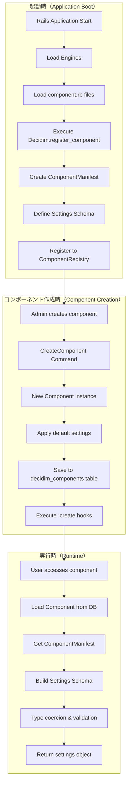
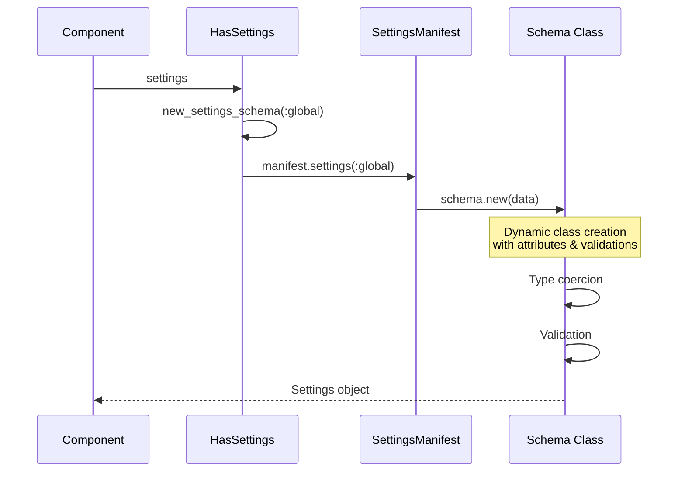
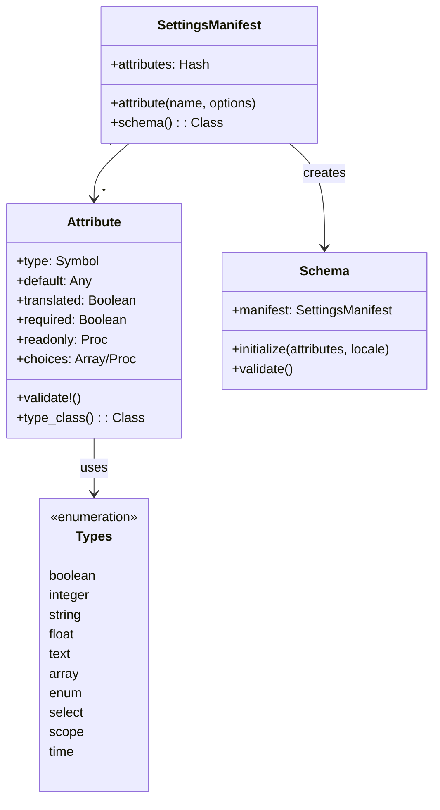

# コンポーネント登録フロー図

## コンポーネント登録から利用までの全体フロー

```mermaid
graph TB
    subgraph "起動時（Application Boot）"
        A[Rails Application Start] --> B[Load Engines]
        B --> C[Load component.rb files]
        C --> D[Execute Decidim.register_component]
        D --> E[Create ComponentManifest]
        E --> F[Define Settings Schema]
        F --> G[Register to ComponentRegistry]
    end
    
    subgraph "コンポーネント作成時（Component Creation）"
        H[Admin creates component] --> I[CreateComponent Command]
        I --> J[New Component instance]
        J --> K[Apply default settings]
        K --> L[Save to decidim_components table]
        L --> M[Execute :create hooks]
    end
    
    subgraph "実行時（Runtime）"
        N[User accesses component] --> O[Load Component from DB]
        O --> P[Get ComponentManifest]
        P --> Q[Build Settings Schema]
        Q --> R[Type coercion & validation]
        R --> S[Return settings object]
    end
    
    G --> H
    M --> N
```

## 設定スキーマの動的生成

```mermaid
sequenceDiagram
    participant C as Component
    participant HS as HasSettings
    participant SM as SettingsManifest
    participant SC as Schema Class
    
    C->>HS: settings
    HS->>HS: new_settings_schema(:global)
    HS->>SM: manifest.settings(:global)
    SM->>SC: schema.new(data)
    Note over SC: Dynamic class creation<br/>with attributes & validations
    SC->>SC: Type coercion
    SC->>SC: Validation
    SC-->>C: Settings object
```

## 管理画面での設定更新フロー

```mermaid
flowchart LR
    subgraph "Frontend"
        A[Admin Form] --> B[Submit Settings]
    end
    
    subgraph "Controller"
        B --> C[ComponentsController#update]
        C --> D[Build ComponentForm]
        D --> E[Validate Form]
    end
    
    subgraph "Command"
        E --> F[UpdateComponent]
        F --> G[Begin Transaction]
        G --> H[Save old settings]
        H --> I[Update attributes]
        I --> J[Restore readonly]
        J --> K[Save to DB]
        K --> L[Publish events]
        L --> M[Commit Transaction]
    end
    
    subgraph "Response"
        M --> N[Success/Error]
        N --> O[Redirect/Render]
    end
```

## 設定の型システム

```mermaid
classDiagram
    class SettingsManifest {
        +attributes: Hash
        +attribute(name, options)
        +schema(): Class
    }
    
    class Attribute {
        +type: Symbol
        +default: Any
        +translated: Boolean
        +required: Boolean
        +readonly: Proc
        +choices: Array/Proc
        +validate!()
        +type_class(): Class
    }
    
    class Schema {
        +manifest: SettingsManifest
        +initialize(attributes, locale)
        +validate()
    }
    
    SettingsManifest "1" --> "*" Attribute
    SettingsManifest --> Schema : creates
    
    class Types {
        <<enumeration>>
        boolean
        integer
        string
        float
        text
        array
        enum
        select
        scope
        time
    }
    
    Attribute --> Types : uses
```