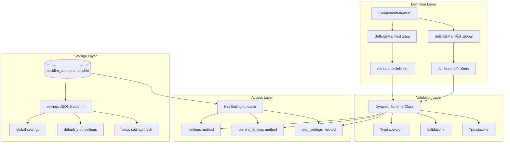
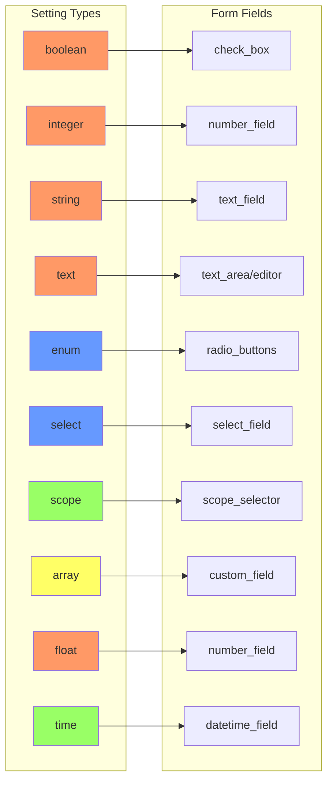
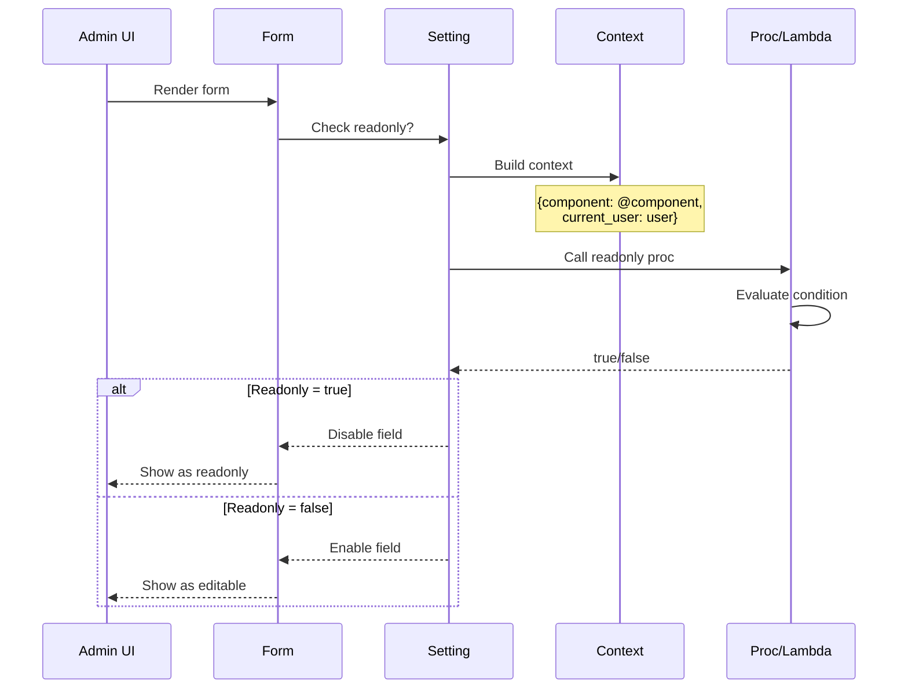
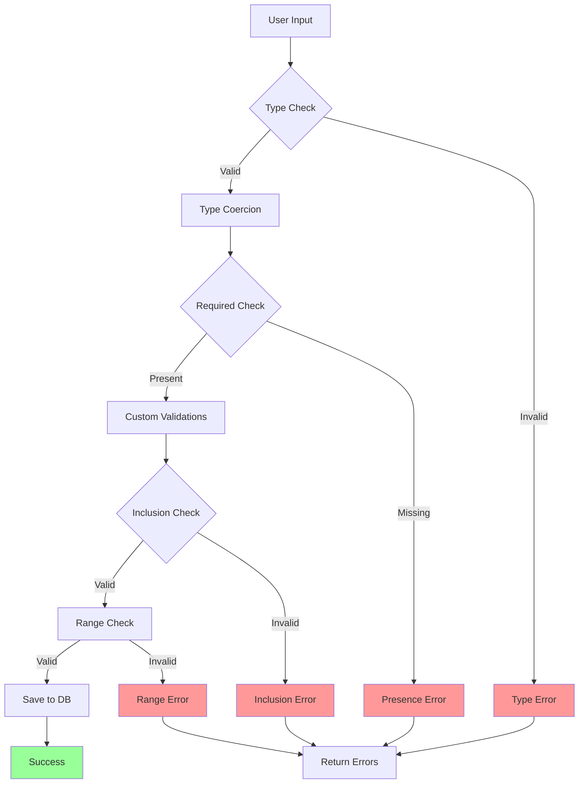

# 設定システムアーキテクチャ図

## 設定システムの全体構造



## 設定型とフォームフィールドのマッピング



## 条件付き設定の評価フロー



## 多言語設定の構造

```mermaid
classDiagram
    class TranslatableAttribute {
        +name: Symbol
        +type: Symbol
        +translations: Hash
        +default_locale: Symbol
    }
    
    class Translation {
        +locale: Symbol
        +value: String
    }
    
    class SettingsJSON {
        announcement: {
            en: "Welcome",
            ja: "ようこそ",
            es: "Bienvenido"
        }
    }
    
    TranslatableAttribute "1" --> "*" Translation
    SettingsJSON --> TranslatableAttribute : stored as
    
    note for TranslatableAttribute "translated: true enables<br/>multi-language support"
```

## 設定の検証パイプライン

